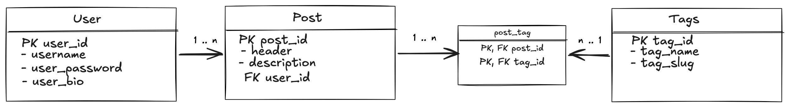

# The task:

>Продемонструвати роботу з моделями, а саме:
>- створити міграції та сформуйте структуру БД
>- забезпечити щоб в БД були такі сутності, між якими буде встановлений зв’язок один-до-багатьох та багато-до-багатьох
>- hasMany
>- belongsToMany
>- побудувати відповідні рути та контролери, які дозволять вам мати навігацію по сутностям із БД. Приклад показано у прикріпленому відео

# ER diagram: 
